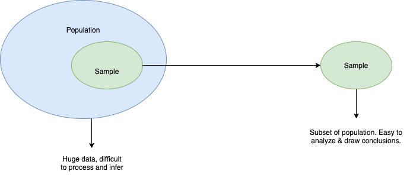
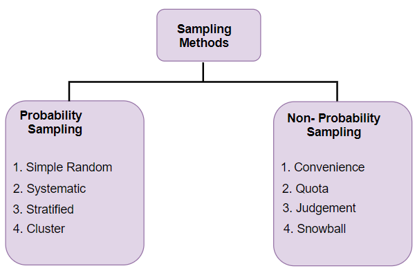
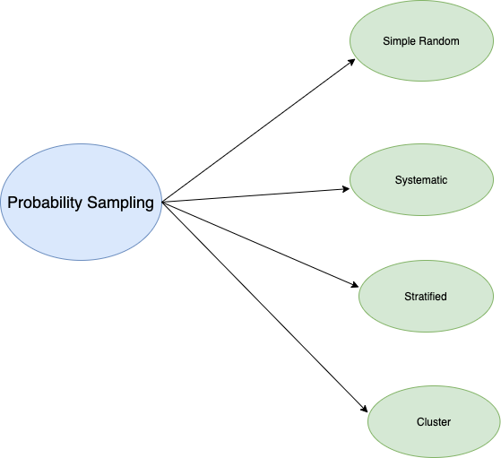
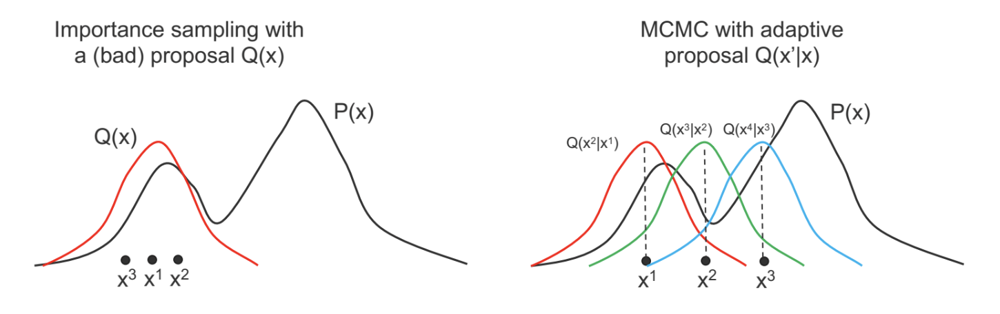
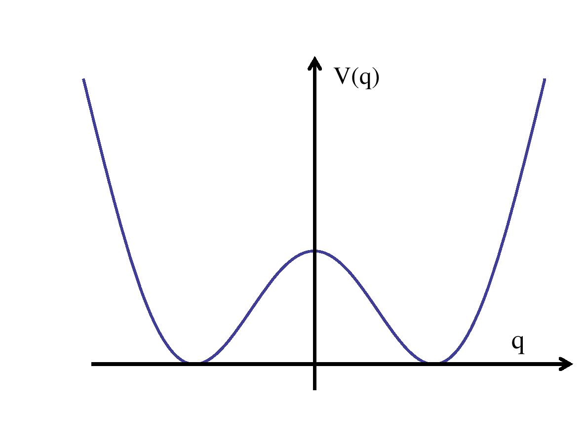
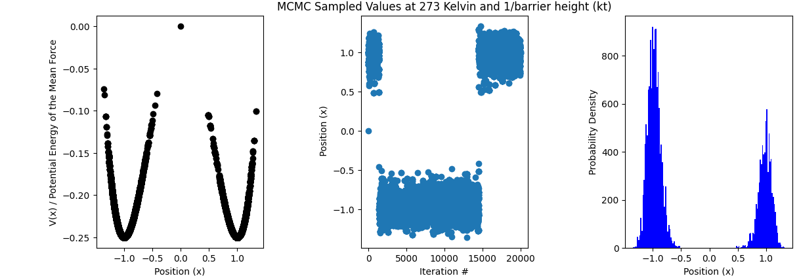

# Group Meeting Presentation: MCMC Sampling

Date: 11/03/202
Author: Siba Moussa

---
# Sampling is a tool to characterize whole population properties

Useful when: 
- Not possible to directly calculate analytical solutions 
- No access to all possible observations (expensive, challenging, continous data collection)
- Benefits:
    - greater speed  
    - reduced cost

    <!--- It is a statistical method that allows use to select a subset of data points from the population to analyze and characterize the whole population properties. -->

    <!--- most common types of sampling techniques: 
    1) probability sampling - every element of the population has an equal probability of being sampled, could be truely represenative sample of the whole population
    2) non probability sampling - not all elements have an equal chance of being selected: risk of non represenative sample -- >

---
# Sampling Methods

<!-- all sampling methods involve calling some kind of simple subroutine multiple times. computers can generate samples from very simple distributions. Simple samplinggives everyone in the target population an equal and known probability of being selected as a respondent in the same group. We will talk about one particular sampling method which is systemtic sampling  -->

---

# Probability Sampling 

---

# Monte Carlo Methods are one common example of systematic sampling

1) Generate random samples from a given probability distribution $P(x)$
2) Expectations $E[f(x)]$ reveal properties about $P(x)$ (i.e. mean, variances)
3) Uses $Q(x)$ as proposal (samples are statistically independent, uses random sampling)

- Example applications:
  - simuate systems such as fluids, disordered materials,and cellular structures
  - calculate risks in business, cost overruns and schedule overruns 
  - optimize a function  (i.e. locating sample that maximizes/minimizes target function)

<!--- - Random sampling of probability distribution used to:  also used for optimization and numerical integration , ie. repeated samplings of random walk over a set of probabilities-->
- Limitations
  - Hard to get rare events in high-dimensional spaces
  - Doesn't work well if proposal $Q(x)$ is very different from $P(x)$

---
# Markov Chain Monte Carlo (MCMC) sampling uses adaptive features
- Instead of using a fixed proposal $Q(x)$, use an adaptive proposal
- If you want a parametrized probability distribution (set of probabilities)
- Autocorrelated sampling since the transition from one state to another is probability dependent
-  Uses Markov Chains to model probabilities and set of transitions and their probabilities
- Some algorithms for the random walk:
  - Metropolis hastings,  Gibbs sampling,  Metropolis - adjusted Langevin, Pseudo-marginal Metro-Hastings, Slice Sampling, Hamlitonian

---
# Markov Chains are a sequence of random variables $x^{(1)},x^{(2)},...,x^{(n)}$ 
- **Markov property**: $(P(x^{(n)}=x\ |x^{(1)}, ..., x^{(n-1)})=P(x^{(n)}=x\ |x^{(n-1)}))$
- **Probability distribution over states**: ${\pi}^t(x)$ a distribution over the state of the system x, at time t
- **Transition Kernel**: $P(x^{(n)}=x|x^{(n-1)})$ =  $T(x'|x)$ 
- **Transitions**: states transition from $x^t$ to $x^{t+1}$ according to the transition kernel $T(x'|x)$ 
- **Transition of entire distributions**: $\pi^{(t+1)}(x')=\sum_{x} \pi^{(t)}(x)T(x' \mid x)$

<!--- Stationary distributions - remove the time factor -->
- **Must be ergodic (regular)**: can return to any state x at any time and can get from any state $x$ to any state $x'$ with probability > 0 in a finite number of steps 
  <!--- implies ability to reach stationary distribution -->
- **Reversible property (detailed balance)**: an MC is reversible if there exists a distribution $\pi(x)$ such that the detailed balance condition is satisfied: $(\pi(x')T(x|x')=\pi(x)T(x'|x))$  
 
---
# Metropolis Hastings Variant
- Adaptive proposal: use $Q(x'|x)$ instead of $Q(x)$ where $x'$ is the new state being sampled and x is the previous
- As $x$ changes <!--- based on some probability $A(x'|x)=min(1,P(x')Q(x|x')/P(x)Q(x'|x))$ ) -->, $Q(x'|x)$ can also change as a function of $x'$

---
# Metropolis Hastings Algorithm 
1. Choose a target distribution: a function $f(x)$ that is proportional to the desired probability density function $P(x)$ 

2. Initialize the algorithm:
  - choose an arbitrary point as the first observation: $x$
  - choose an arbitrary probability (proposal) density $Q(x'|x)$ to suggest a candidate for the next sample value $x'$ given previous value $x$
  - assume $Q$ is symmetric such that $Q(x'|x)$=$Q(x|x')$

3. For each iteration, t: 
  - Generate a candidate $x'$ for the next sample by picking from the distribution $Q(x'|x)$
  - Calculate the acceptance ratio : $\alpha =f(x')/f(x) = P(x')/P(x)$  <!--- can use proposal density because of proportinality -->
- Accept or reject:
  - Generate a uniform random number $u \in [0,1]$ 
  - If $u \leq \alpha$, **accept** the candidate by setting the new $x=x'$
  - if $u > \alpha$, **reject** the candidate and set the new $x=x$

---
# MH-Implementation for Double-well potential: Setting up
Consider the case of a particle in double-well potential:

- $f(x)=ax^2+bx^4=-0.5x^2+0.25x^4$
- $P(x)=exp((-\beta)f(x))$
- $\beta=kT$ 
- $Q(x')=  x +$ random uniform number $\in (-1,1)$
- initial $x=0$

--- 
# MH-Algorithm Implementation to Simulate Double Well Potential

Code is on github: 

---
# Some issues with Monte Carlo (which we are trying to tackle with gflownet)

<!--- MH has a burn in period: an initial # of samplers are thrown away because they are not the true distribution -->
  - represents the unconverged part of the markov chain

---
# Additional Features:
- Added (Stochastic Tunneling) STUN Algorithm
- Annealing

---
# References
https://sailinglab.github.io/pgm-spring-2019/notes/lecture-14/